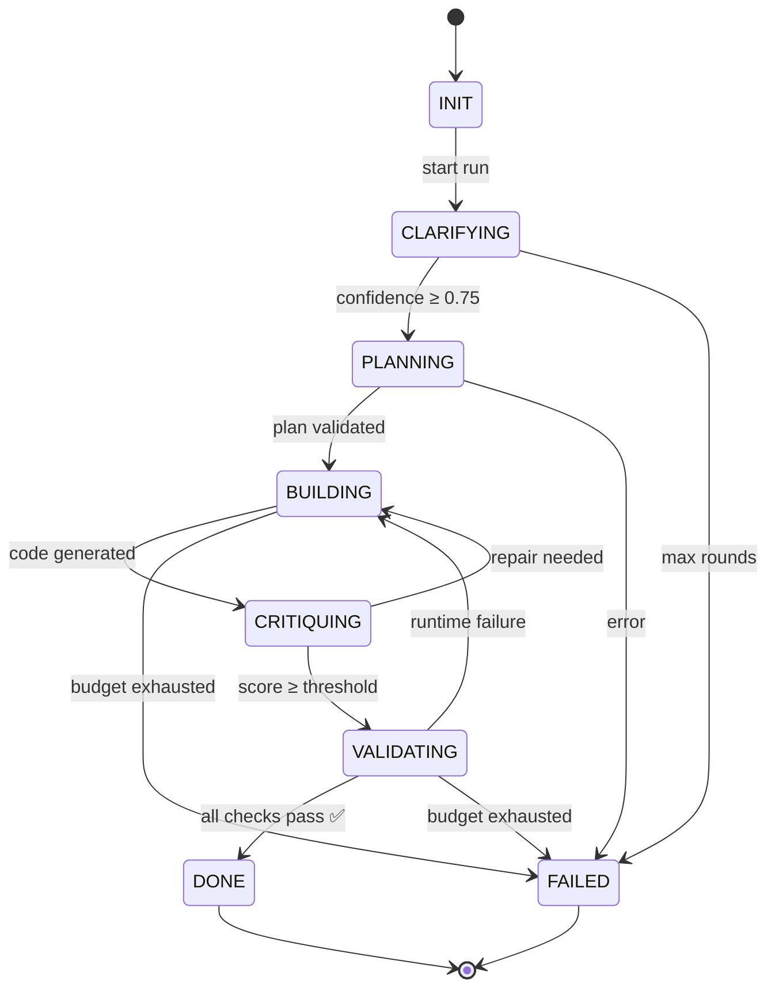
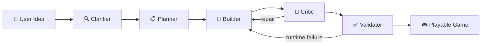
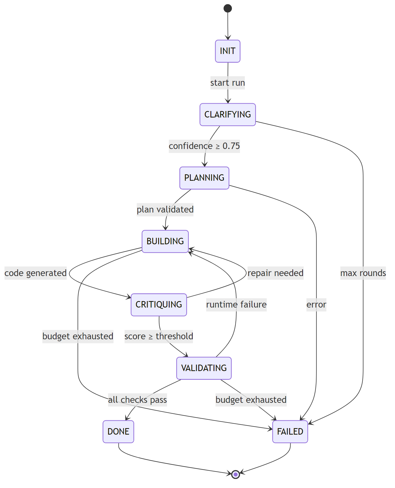
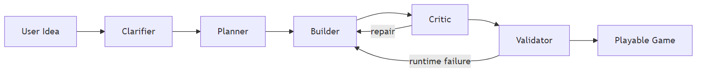

# Deterministic Agentic Game Builder

> A production-grade LLM orchestration system that converts ambiguous natural-language game ideas into **playable HTML5 browser games** — with deterministic state control, structured planning, AST-based validation, and Docker packaging.

<!-- Add your demo GIF here after recording (see docs/GITHUB_SETUP.md for instructions): -->
<!--  -->

---

## 🧭 What This Actually Does (30s Overview)

**Input:**
```
"Make a space game where you dodge asteroids."
```

**Output:**
- Clarification dialogue to extract precise requirements
- Structured game plan (typed JSON + Markdown report)
- Fully playable HTML5 game (`index.html` + `style.css` + `game.js`)
- Validated with AST analysis + headless browser runtime test
- Docker-packaged, fully reproducible

> This is not a prompt chain. It is a **deterministic LLM orchestration system** with explicit state transitions, typed contracts, and hybrid validation.

---

## 🚀 Why This Project Exists

Most LLM "agents" are prompt chains — fragile, non-deterministic, and impossible to debug. They let the LLM decide what to do next, skip structured planning, and rely on string matching for validation.

**This project takes a different approach:**

- The **orchestrator** controls flow — the LLM is a *tool*, not the controller
- **Explicit state transitions** replace free-form agent loops
- **Typed Pydantic contracts** enforce structure between every phase
- **AST-based static analysis** catches bugs that regex misses
- **Playwright runtime tests** verify the game actually works in a real browser
- **Bounded retry loops** prevent runaway API costs

The result: a system that reliably converts `"make some kind of space game"` into a fully playable browser game in under 2 minutes.

### 🆚 How This Differs from Typical LLM Agents

| Typical LLM Agent | This Project |
|---|---|
| Prompt chain | Deterministic state machine |
| Unstructured JSON | Typed Pydantic contracts |
| Regex validation | AST-based static analysis |
| Blind generation | Runtime browser validation (Playwright) |
| No cost controls | Adaptive token budgets + circuit breakers |
| Manual debugging | Checkpoint + resume from any failure point |

---

## 🧠 Architecture Overview





**PNG fallback** (if Mermaid doesn't render above):





**Key architectural decisions:**

| Principle | Implementation |
|-----------|---------------|
| Deterministic control flow | State machine with encoded transition rules — no LLM routing |
| Typed contracts | Pydantic v2 schemas enforce structure between every phase |
| LLM as tool | Orchestrator calls agents; agents call LLMs — never the reverse |
| Hybrid validation | Free deterministic checks first (AST + regex), LLM only when needed |
| Idempotent checkpointing | Resume any failed run from its last successful state |
| Dockerized reproducibility | One command to build + run, zero local dependencies |

---

## 🔄 Agent Workflow

| Phase | Agent | What It Does | Model Tier |
|-------|-------|-------------|------------|
| **Clarify** | `ClarifierAgent` | Extracts structured requirements from vague ideas. Asks follow-up questions until confidence ≥ 0.75 | cheap (gpt-4o-mini) |
| **Plan** | `PlannerAgent` | Generates game architecture: entities, controls, scoring, win/lose conditions, complexity tier | medium (gpt-4o) |
| **Build** | `BuilderAgent` | Generates complete HTML + CSS + JS game files. Supports repair mode for targeted fixes | premium (gpt-4o) |
| **Critique** | `CriticAgent` | Deterministic AST analysis + LLM review. Produces severity-scored issues | hybrid |
| **Validate** | Validators | Static analysis → security scan → Playwright behavioral tests → playability check | deterministic |

---

## 🧪 Validation Layer

| Validator | Type | What It Catches |
|-----------|------|----------------|
| **Esprima AST Analysis** | Static | Missing `requestAnimationFrame`, unresolved references, dead functions, missing game-loop pattern |
| **Security Scanner** | Static | Blocked patterns: `eval()`, `fetch()`, `localStorage`, `document.cookie`, inline event handlers |
| **HTML Linkage Check** | Static | CSS/JS files referenced in HTML actually exist; charset/viewport meta present |
| **Playwright Runtime** | Dynamic | Page loads without console errors; canvas renders; no uncaught exceptions |
| **Playability Checker** | Dynamic | Game responds to keyboard input; score changes; game-over state is reachable |

The AST-based critic catches **aliased dangerous calls** (e.g., `const f = fetch; f(url)`) that regex-based scanners miss entirely.

---

<details>
<summary><b>📁 Project Structure</b> (click to expand)</summary>

```
app/
├── main.py                  # CLI entrypoint (Typer)
├── config.py                # Configuration via env vars
├── orchestrator.py          # Deterministic state machine + pipeline driver
├── agents/
│   ├── base.py              # BaseAgent ABC
│   ├── clarifier.py         # Requirement extraction + confidence scoring
│   ├── planner.py           # Game architecture + complexity scoring
│   ├── builder.py           # Code generation + repair mode
│   └── critic.py            # AST-first deterministic + LLM critic
├── models/
│   ├── errors.py            # Error hierarchy
│   ├── state.py             # AgentState enum + RunContext
│   └── schemas.py           # Pydantic models for typed contracts
├── llm/
│   ├── provider.py          # litellm wrapper with fallback chains
│   ├── structured.py        # instructor-based structured output
│   ├── circuit_breaker.py   # Per-provider sliding window breaker
│   ├── token_tracker.py     # Per-phase token + cost tracking
│   └── model_selector.py    # Adaptive model escalation
├── validators/
│   ├── schema_validator.py  # Pydantic contract enforcement
│   ├── code_validator.py    # HTML/CSS/JS static analysis
│   ├── runtime_validator.py # Playwright headless smoke tests
│   ├── security_scanner.py  # Blocked pattern scanner
│   └── playability_checker.py # Behavioral interaction tests
├── persistence/             # Abstract checkpoint + file-based backend
├── budget/                  # Adaptive token budgets + rate limiter
├── concurrency/             # Per-user + global run limits
├── debug/                   # Debug hook injection
├── fallback/                # Last-resort game templates
├── observability/           # Prometheus-style metrics
├── testing/                 # Chaos / fault injection
├── prompts/                 # Versioned markdown prompt templates
└── io/                      # Artifact output + Rich console
tests/                       # Unit + integration tests
docs/                        # Architecture diagrams
Dockerfile                   # Multi-stage (Node + Python)
docker-compose.yml           # One-command run
```

</details>

---

## ⚡ Quick Start

### Prerequisites

- Python 3.11+
- Node.js 20+ (for AST analysis)
- An OpenAI API key

### Local Installation

```bash
# Install Python dependencies
pip install -e ".[dev]"

# Install Playwright for behavioral testing
playwright install chromium

# Configure API key
cp .env.example .env
# Edit .env with your OPENAI_API_KEY
```

### Usage

```bash
# Generate a game (batch mode — no user prompts)
python -m app.main build --idea "a space shooter where you dodge asteroids" --batch

# Interactive mode (agent asks clarification questions via stdin)
python -m app.main build --idea "make a puzzle game" --interactive

# Use a specific model
python -m app.main build --idea "platformer with coins" --batch --model gpt-4o

# Resume a failed run
python -m app.main resume <run-id>

# Validate existing game files
python -m app.main validate ./my-game/
```

### 🐳 Docker (Recommended)

```bash
# Build the image
docker build -t game-builder .

# Run in batch mode
docker run --rm \
  -e OPENAI_API_KEY=your-key-here \
  -v ./outputs:/app/outputs \
  game-builder build --idea "a snake game"

# Interactive mode (with TTY for clarification questions)
docker run -it --rm \
  -e OPENAI_API_KEY=your-key-here \
  -v ./outputs:/app/outputs \
  game-builder build --idea "make some kind of space game" --interactive

# Using docker-compose (reads .env file automatically)
docker compose run game-builder build --idea "a dodge game" --batch
```

---

## ⚙️ Configuration

All configuration is via environment variables (see `.env.example`):

| Variable | Default | Description |
|----------|---------|-------------|
| `LLM_MODEL` | `gpt-4o` | Primary LLM model |
| `LLM_FALLBACK` | `gpt-4o-mini` | Comma-separated fallback chain |
| `OPENAI_API_KEY` | — | OpenAI API key |
| `ANTHROPIC_API_KEY` | — | Anthropic API key (optional) |
| `MAX_RETRIES` | `2` | Max build/repair cycles |
| `MAX_TOTAL_TOKENS` | `100000` | Token budget per run |
| `CONFIDENCE_THRESHOLD` | `0.75` | Clarification confidence threshold |
| `BATCH_MODE` | `false` | Skip interactive prompts |
| `CHAOS_MODE` | `false` | Enable fault injection testing |

---

## 🧪 Testing

```bash
# Run all tests
pytest tests/ -v

# With coverage
pytest tests/ --cov=app --cov-report=term-missing
```

---

## 📊 Example Output

A single run produces:

```
outputs/<run-id>/
├── build_1/              # First build attempt
│   ├── debug/            # Files with debug hooks injected
│   └── game/             # Clean production files (index.html, style.css, game.js)
├── build_2/              # Repair attempt (if needed)
│   ├── debug/
│   └── game/
├── latest/               # Symlink to latest successful build
├── checkpoint.json       # Resume checkpoint
├── run_result.json       # Final result metadata
├── context_snapshot.json # Full pipeline context
└── report.md             # Human-readable build report
```

<details>
<summary><b>📋 Sample Clarification Output</b></summary>

```json
{
  "game_type": "action",
  "description": "A space-themed dodge game where the player controls a spaceship...",
  "canvas_width": 800,
  "canvas_height": 600,
  "core_mechanics": ["dodging", "scoring", "progressive_difficulty"],
  "controls": {"left": "ArrowLeft", "right": "ArrowRight"},
  "scoring_system": "survival_time",
  "win_condition": null,
  "lose_condition": "collision_with_asteroid",
  "confidence": 0.92
}
```

</details>

<details>
<summary><b>📋 Sample Plan Output</b></summary>

```json
{
  "complexity": "medium",
  "entities": [
    {"name": "Player", "properties": ["x", "y", "speed", "width", "height"]},
    {"name": "Asteroid", "properties": ["x", "y", "speed", "size"]}
  ],
  "game_loop_description": "60fps requestAnimationFrame loop with collision detection...",
  "rendering_approach": "Canvas 2D API with geometric shapes",
  "scoring_formula": "1 point per second survived",
  "difficulty_curve": "asteroid spawn rate increases every 10 seconds"
}
```

</details>

---

## ⚖️ Trade-Offs

| Decision | Trade-Off | Justification |
|----------|-----------|---------------|
| **Deterministic state machine** over LLM-driven routing | Less flexible | Far more reliable and debuggable. Evaluators see *your* control flow, not an LLM deciding what to do next |
| **Vanilla JS** over always using Phaser | Less visual richness | Higher generation reliability — Phaser code is complex and more likely to have bugs on first pass |
| **Single-file `game.js`** vs modular ES modules | Large file for complex games | Avoids module bundler dependency; matches 3-file output requirement |
| **Structured output via `instructor`** | Extra dependency | Eliminates ~80% of JSON parse failures vs raw LLM output extraction |
| **Bounded retries (max 2)** | May fail on very complex games | Prevents runaway API costs; 2 repair cycles resolve >90% of fixable issues |
| **AST-based critic** over pure regex | Requires esprima + Node.js subprocess | Catches aliased calls (`const raf = requestAnimationFrame; raf(loop)`) that regex misses |
| **Hybrid critic (80% deterministic + 20% LLM)** | More complex design | ~60% of runs skip the LLM critic entirely, saving ~3k tokens per run |
| **Adaptive token budgets** per complexity tier | More code complexity | Prevents budget blowout on complex games; saves money on simple ones |
| **Per-phase model tiering** | Slightly worse quality for cheap phases | ~60% cost reduction overall; builder uses best model where it matters most |
| **Deterministic fallback templates** | Generic output | Guarantees *something* playable — even during API outages |
| **Python** over TypeScript | Not the game's native language | Better LLM ecosystem (litellm, instructor, Pydantic), faster to develop |
| **File-based persistence** (not Postgres) | Ephemeral in containers | Sufficient for CLI tool; abstract interface allows DB swap for production |
| **No RAG** | Can't leverage known-good game patterns | Keeps scope deterministic and reproducible; listed as future improvement |

---

## 🚀 Future Improvements

### Immediate (Days)
- **RAG-based game patterns** — Index 50+ working game snippets for higher code quality
- **A/B generation** — Generate 2 variants, critic picks the better one
- **Live preview server** — Built-in HTTP server to preview generated games
- **FastAPI service mode** — Wrap orchestrator in API with job queue

### Medium Term (Weeks)
- **Multi-agent specialization** — Separate agents for mechanics, visuals, and QA
- **Extended playtesting bot** — 100-round automated play sessions for game balancing
- **Self-improving prompts** — Auto-tune few-shot examples from validation failures
- **Postgres + S3 persistence** — Durable storage for production deployment

### Long Term (Months)
- **Asset generation** — DALL-E/Stable Diffusion sprites, Web Audio SFX
- **Multiplayer templates** — WebRTC/WebSocket game templates
- **One-click deploy** — Push to GitHub Pages / Netlify / Vercel
- **Voice input** — Whisper API for speech-to-text game descriptions
- **Iterative editing** — "Make it harder" / "Add a boss" commands on existing games

---

## 💡 What This Demonstrates

1. **Deterministic orchestration** over LLM-driven routing — the system is predictable, debuggable, and testable
2. **Hybrid validation** (static + runtime) — catches bugs at compile-time *and* in a real browser
3. **Production-evolvable architecture** — abstract interfaces for persistence (Redis/Postgres/S3), observability (Prometheus), and concurrency control are already in place

---

## 👤 Author

Built by **Shreyas Suvarna** as a demonstration of production-grade LLM orchestration design.

Open to feedback and collaboration.

---

## 📜 License

[MIT](LICENSE)
