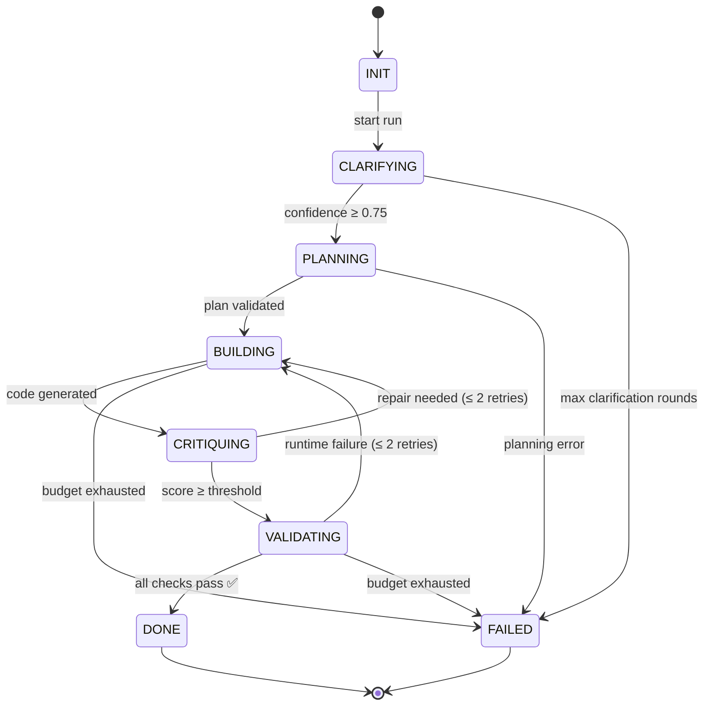
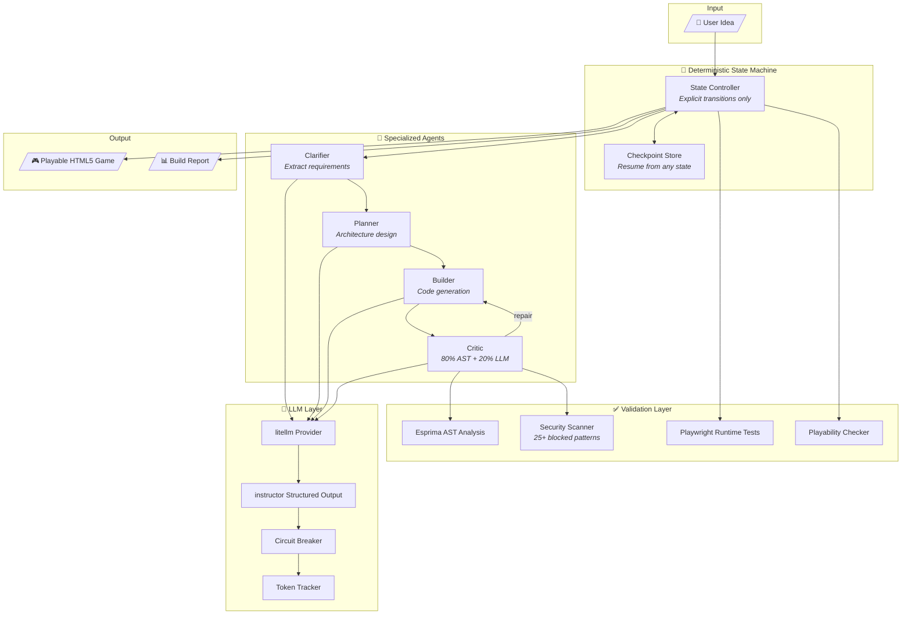

# Architecture Diagram (Mermaid)

Render this in GitHub README or any Mermaid-compatible viewer.

```mermaid
stateDiagram-v2
    [*] --> INIT
    INIT --> CLARIFYING : start run
    CLARIFYING --> PLANNING : confidence ≥ 0.75
    CLARIFYING --> FAILED : max clarification rounds
    PLANNING --> BUILDING : plan validated
    PLANNING --> FAILED : planning error
    BUILDING --> CRITIQUING : code generated
    BUILDING --> FAILED : budget exhausted
    CRITIQUING --> VALIDATING : score ≥ threshold
    CRITIQUING --> BUILDING : repair needed (≤ 2 retries)
    VALIDATING --> DONE : all checks pass ✅
    VALIDATING --> BUILDING : runtime failure (≤ 2 retries)
    VALIDATING --> FAILED : budget exhausted
    DONE --> [*]
    FAILED --> [*]
```

## Component Interaction

```mermaid
flowchart TB
    subgraph Input
        USER[/"💬 User Idea"/]
    end

    subgraph Orchestrator["🎯 Deterministic State Machine"]
        direction TB
        SM["State Controller<br/><i>Explicit transitions only</i>"]
        CP["Checkpoint Store<br/><i>Resume from any state</i>"]
    end

    subgraph Agents["🤖 Specialized Agents"]
        CL["Clarifier<br/><i>Extract requirements</i>"]
        PL["Planner<br/><i>Architecture design</i>"]
        BU["Builder<br/><i>Code generation</i>"]
        CR["Critic<br/><i>80% AST + 20% LLM</i>"]
    end

    subgraph Validation["✅ Validation Layer"]
        AST["Esprima AST Analysis"]
        SEC["Security Scanner<br/><i>25+ blocked patterns</i>"]
        PW["Playwright Runtime Tests"]
        PLAY["Playability Checker"]
    end

    subgraph LLM["🧠 LLM Layer"]
        LIT["litellm Provider"]
        INS["instructor Structured Output"]
        CB["Circuit Breaker"]
        TT["Token Tracker"]
    end

    subgraph Output
        GAME[/"🎮 Playable HTML5 Game"/]
        REPORT[/"📊 Build Report"/]
    end

    USER --> SM
    SM --> CL --> PL --> BU --> CR
    CR -->|"repair"| BU
    CR --> SEC & AST
    SM --> PW & PLAY
    CL & PL & BU & CR --> LIT
    LIT --> INS --> CB --> TT
    SM --> GAME & REPORT
    SM <--> CP
```
